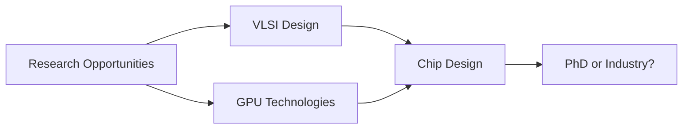

<div align="center">

#  Hi, I'm Thinh Phuc Nguyen

### 💻 Electrical & Computer Engineering Student | 📍 Boston, MA


</div>

---


## 💡 About Me

```python
class ThinhPhucNguyen:
    def __init__(self):
        self.location = "Boston, MA"
        self.education = "ECE @ Boston University"
        self.interests = [
            "Embedded Systems",
            "Computer Vision", 
            "Hardware Acceleration",
            "Reinforcement Learning"
        ]
    
    def current_focus(self):
        return "Building systems from silicon to software 🚀"
```

- 🔭 Working on **kernel modules** and **real-time vision pipelines**
- 🌱 Exploring **VLSI design** and **GPU technologies**
- ⚡ Building whatever inspires me at any given moment!

<br clear="right"/>

---

## 🎯 Featured Projects

<div align="center">

| 🐱 Computer Vision | 🎮 Game Development | 👓 Hardware Design |
|:---:|:---:|:---:|
| **[Deblur My Cat](https://github.com/thinhphucnguyen/Deblur-my-cat)** | **[BattleShip Game](https://github.com/thinhphucnguyen/BattleShip-Game)** | **[Text Glasses](https://github.com/thinhphucnguyen/Senior-Design-Text-Glasses)** |
| Image deconvolution pipeline with advanced signal processing | Strategic AI battleship with clean architecture | Real-time text recognition wearable device |
| `Python` `MATLAB` `OpenCV` | `C++` `Game Logic` `AI` | `ARM` `Embedded` `CV` |

</div>

<div align="center">
  
### 🔗 [Explore All Projects →](https://github.com/thinhphucnguyen?tab=repositories)

</div>

---

## 🛠️ Technical Arsenal

<div align="center">

### Languages & Frameworks
<p>
  
  
  
  
  
</p>

### Embedded & Systems
<p>
  
  
  
  
</p>

### AI/ML & Vision
<p>
  
  
  
  
</p>

</div>

<div align="center">
### 🎯 Current Goals


